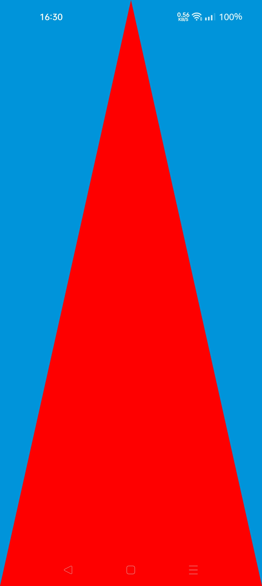

# `wgpu` & `winit` Android Example

Tested on

- Realme 9 Pro Android 12
- Asus Zenfone Max Pro Android 9

using Vulkan and OpenGL backend.

## Versions

- [v0.13](v0.13/)
- [v0.9](v0.9/)

## Requirements

- `cargo apk`. You can install it by running `cargo install cargo-apk`
- Toolchain target. You can install it by running `rustup target install armv7-linux-androideabi aarch64-linux-android i686-linux-android x86_64-linux-android`

## Getting Started

1. Connect Android device
2. `cargo apk run`

## Screenshot

You should see a triangle as below

