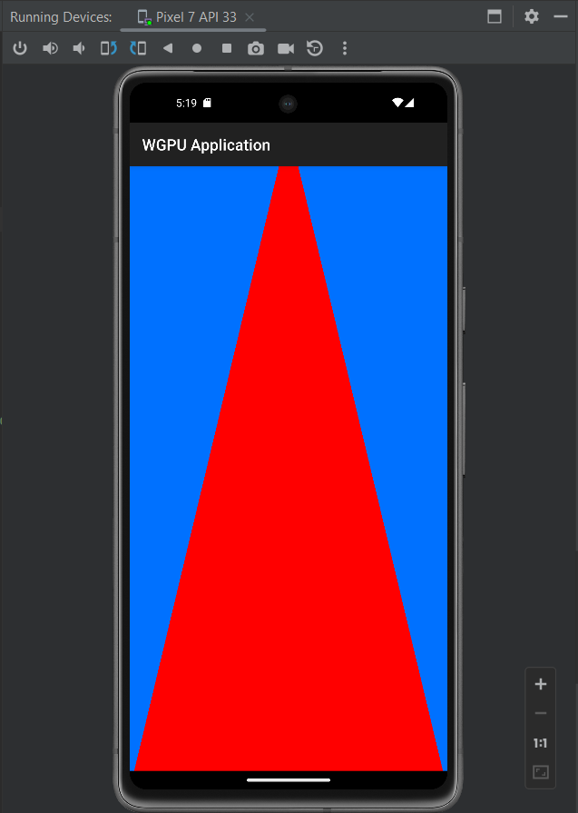

# `wgpu` & `winit` Android Example



Tested on

- Realme 9 Pro Android 12
- AVD Pixel 7 API 33

using Vulkan and OpenGL backend.

See other branch for other wgpu version example.

## Requirements

- Toolchain target. You can install it by running `rustup target install armv7-linux-androideabi aarch64-linux-android i686-linux-android x86_64-linux-android`
- Android Studio and NDKs

## Getting Started

- Open the project in Android Studio
- Update `ndkVersion` in `app/local.properties` to match one you have installed. For example

```
ndkVersion=27.1.12297006
```

- Sync gradle
- Press **run 'app'** once the project has been loaded
